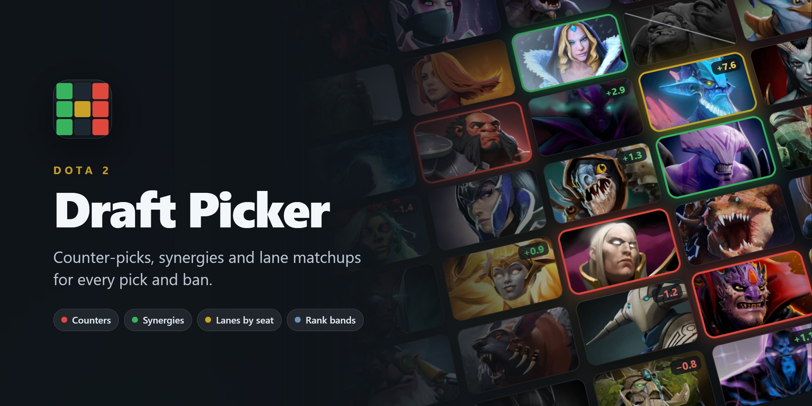
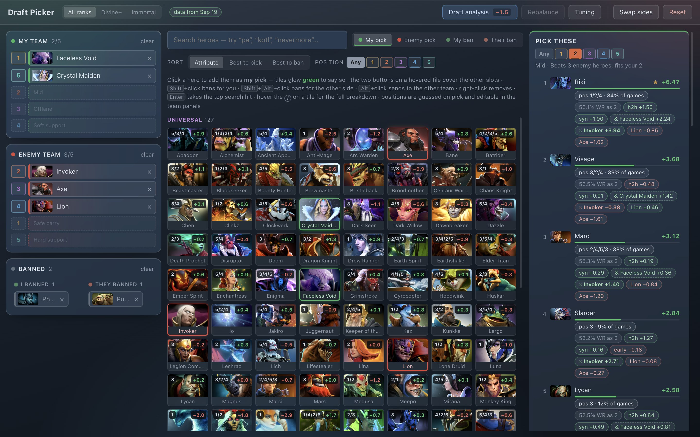

<div align="center">



<!-- badges:start — written by `npm run readme` from public/data; change scripts/readme-status.mjs, not this block -->
<p>
  
  <a href="https://www.dota2.com/patches"></a>
  
  
  <br>
  <a href="#the-data"></a>
  <a href="#license"></a>
  <a href="https://github.com/yarikleto/dotabuff-picker/actions/workflows/pages.yml"></a>
</p>

<h3><a href="https://yarikleto.github.io/dotabuff-picker/">Open the picker →</a></h3>
<!-- badges:end -->

<sub><a href="#what-it-weighs">What it weighs</a> · <a href="#the-data">The data</a> · <a href="#using-it">Using it</a> · <a href="#updating-the-data">Updating the data</a> · <a href="#run-it-yourself">Run it yourself</a> · <a href="docs/scoring.md">How it scores</a> · <a href="#license">License</a></sub>

</div>

<br>

A pick/ban assistant for Dota 2. Mark who the enemy took, who you took and what
got banned: it ranks the heroes that match up best into the enemy line-up *and*
work best beside your own, reads every lane seat by seat, and tells you which
hero the enemy most wants next. It runs in the browser, with nothing to install.



## What it weighs

- **Counters** — how each candidate fares against every enemy hero already
  drafted, from Dotabuff's matchup tables.
- **Synergy** — how it works beside your own heroes, from OpenDota match
  records, split by which of the two took the farm.
- **Lanes, seat by seat** — where it would share a lane with an enemy, how the
  *games* went for that hero in that position against that opponent, from
  STRATZ lane outcomes. A pos 1 Pudge into an Axe gets a mention of its own
  when the reading is big enough to earn the stretch.
- **Positions by rank** — who plays where, and how well, at All ranks, Divine+
  or Immortal: the switch in the top bar.
- **Game length** — whether your line-up would still have nobody who functions
  before the median game is over.
- **Enemy intent** — the ban list is the same ranking run from the enemy's seat:
  what they most want next.
- **Rebalance** — the same five heroes in better seats, when a reshuffle beats a
  new pick.
- **Win chance** — the board as one calibrated figure: a model whose weights are
  fitted on real ranked games at every refresh, so a 38% means drafts like it
  won about 38% of the time. Five cores and no supports reads 16% — you are
  being run over (calibration of Sep 23, 2026).

Every figure is damped by its own sample size before it counts for anything.
The derivation, the weights and the known blind spots are in
[docs/scoring.md](docs/scoring.md).

## The data

<!-- data:start — written by `npm run readme` from public/data; change scripts/readme-status.mjs, not this block -->
| Data | Source | Covers | Sample | Patch |
| --- | --- | --- | --- | --- |
| Counters | Dotabuff | read Sep 24, 2026 | 16,002 hero pairs | — |
| Positions by rank | STRATZ | Aug 27 – Sep 23, 2026 | 9.1 million ranked matches | 7.41e – 7.41f |
| Lanes by seat | STRATZ | Aug 27 – Sep 23, 2026 | 50,456 lane pairings | 7.41e – 7.41f |
| Synergies | OpenDota | Sep 23 – Sep 24, 2026 | 613,632 matches | 7.41f |
| Game length | OpenDota | Sep 23 – Sep 24, 2026 | 613,472 matches | 7.41f |
| Win model | OpenDota | Sep 22 – Sep 23, 2026 | 419,724 matches | 7.41f |
<!-- data:end -->

**Data patch** is worked out from the windows above against Valve's patch list:
green when all of it comes from one patch, gold across letter patches of one
version, orange across a major patch, red once Valve had shipped a newer patch
than any in the data. **Latest Dota patch** beside it is read live from Valve
on every view, so the day a patch lands the two badges disagree until the data
is refreshed. The Dotabuff collector does not record the date range behind the
matchup pages, so counters carry no patch of their own.

## Using it

| Action | Result |
| --- | --- |
| Click a hero | Adds them to the active slot (**My pick** / **Enemy pick** / **Ban**) |
| `Shift` + click | Bans, whatever the active slot is |
| `Alt` + click | Sends to the *other* team |
| Right-click | Removes from the draft |
| Just start typing | Focuses the search box |
| `Enter` | Takes the top search hit; `Shift`+`Enter` bans it |
| `Alt`+`1/2/3` | Switches the active slot |
| `Esc` | Clears the search |
| Hover the **i** on a tile | Opens the full breakdown for that hero |
| Click a face under **Countered by** | Bans that counter |
| Click a face under **Best with** | Adds that hero to your team |
| **Draft analysis** in the top bar | The win chance, the game plan, the matchup map and the full breakdown of the draft on the board |
| **Rebalance** in the top bar | The same five heroes in better seats, when there are any |

Your picks are green, the enemy's are red, bans are greyed out and crossed
through. Once the enemy has heroes on the board, every remaining tile shows its
average advantage against that line-up in the corner. What each panel shows and
how to read it: [docs/ui.md](docs/ui.md).

## Updating the data

After a patch, or whenever the badges above disagree:

```bash
npm run refresh
git add public/data public/heroes src/data/heroes.ts README.md
git commit -m "Refresh data"
git push
```

`refresh` brings the hero roster up to date, runs every collector — counters
from Dotabuff, positions and lane outcomes from STRATZ, synergies and game
lengths from OpenDota, portraits from Valve — and then rewrites the badges and
the table above from what they wrote. A failing step does not stop the others,
an interrupted one picks up from its own cache, and the summary lists the age
of every file and the exact command that retries what failed. The push
publishes the site.

Two collectors need something from you once: the STRATZ steps read a free API
token from the macOS Keychain, and Dotabuff may put up a Cloudflare check the
first time, in a window the counters step opens for it. What to check before
committing, and what to do when a step fails:
[docs/refreshing-data.md](docs/refreshing-data.md#the-routine).

> **Working with an AI agent?** Claude Code picks up the
> [`refresh-data`](.claude/skills/refresh-data/SKILL.md) skill in this repo for
> exactly this job, and [AGENTS.md](AGENTS.md) holds the ground rules for any
> agent.

## Run it yourself

```bash
npm install
npm run dev        # http://localhost:5180
```

The data files are committed, so a fresh clone recommends straight away.

The picker is a static site: the page reads plain JSON from `public/data/` at
runtime, and `.github/workflows/pages.yml` tests, builds and publishes it to
GitHub Pages on every push to `main`. Setup, caching and why every path in the
build is relative: [docs/website.md](docs/website.md).

## Development

```bash
npm test                # parsers, collectors, the scoring engine, the README blocks
npm run build           # typecheck + production bundle
npm run readme:images   # re-render the banner and the screenshot
```

The parser tests are the ones that matter: Dotabuff reshapes its markup
occasionally, and `scripts/fixtures/` pins the structure the parser expects. If
a scrape ever comes back with suspiciously few rows, start there.
`src/lib/*.test.ts` runs straight off the TypeScript with Node's built-in type
stripping; `scripts/ts-resolve.mjs` teaches Node the extensionless imports Vite
already understands.

The two images at the top are rendered from the app itself: `readme:images`
opens the production build mid-draft and `scripts/readme-banner.html` in a
hidden Electron window. Run it after a change you can see.

<details>
<summary><b>Where things live</b></summary>

```
scripts/refresh.mjs          runs every collector in order, then the README step
scripts/roster.mjs           new heroes from OpenDota into src/data/heroes.ts (unit-tested)
scripts/progress.mjs         when an interrupted OpenDota run may resume (unit-tested)
scripts/scrape.mjs           network, caching, orchestration, the 403 hand-off
scripts/scrape-electron.mjs  the same collection from inside a hidden Chromium
scripts/matchups-file.mjs    merging and writing matchups.json (unit-tested)
scripts/parse.mjs            all HTML -> data logic (pure, unit-tested)
scripts/roles.mjs            lane tables -> position 1-5 weights (pure, unit-tested)
scripts/collector-body.js    the in-page collector, injected by scrape-electron
scripts/build-collector.mjs  inlines parse+roles into one injectable script
scripts/synergy.mjs          OpenDota pair collection: windowing, resume, folding
scripts/synergy-math.mjs     expectation + shrinkage (pure, unit-tested)
scripts/timings.mjs          win rate by game length, same pipeline (unit-tested)
scripts/positions.mjs        STRATZ position counts for three rank bands (unit-tested)
scripts/lanes.mjs            STRATZ lane outcomes: weeks, caching, folding (unit-tested)
scripts/stratz.mjs           STRATZ client: token, pacing, hero ids, weeks (unit-tested)
scripts/readme.mjs           the README's badges and data table, from public/data
scripts/readme-status.mjs    patch spans, badges, the table (pure, unit-tested)
scripts/readme-images.mjs    renders docs/assets/banner.jpg and screenshot.jpg
scripts/app-scheme.mjs       app:// URL -> file in dist/ for readme-images (pure, unit-tested)
src/lib/scoring.ts           matchup and synergy maths, lane weighting, the ranking
src/lib/analysis.ts          the draft taken apart: lanes, stages, weak links
src/lib/rebalance.ts         the same five heroes in every other seat and lane
src/lib/roles.ts             position labels, lane pairings, auto-assignment
src/lib/dataset.ts           loads the data files, merges the roster
src/lib/positions.ts         STRATZ counts -> positions for the chosen rank band
src/lib/lanes.ts             lane outcomes: expectation, pairing effects, counters by seat
src/lib/search.ts            hero search, abbreviations, internal names
src/components/HeroCard.tsx  the hover breakdown behind each tile's i icon
src/components/DraftAnalysis.tsx  the panel behind the Draft analysis button
src/components/Rebalance.tsx the reshuffle shortlist behind the top-bar button
src/state/draft.ts           draft reducer + localStorage
src/data/heroes.ts           the hero roster every collector finds heroes through
.github/workflows/pages.yml  tests, builds and publishes the site to GitHub Pages
.claude/skills/refresh-data  the data routine, written for agents
```

</details>

## License

The code is [MIT](LICENSE): use it, change it, ship it, commercially or not.

The data is not the project's to license. Matchups come from
[Dotabuff](https://www.dotabuff.com/heroes), positions and lane outcomes from
[STRATZ](https://stratz.com/), synergies and game lengths from
[OpenDota](https://www.opendota.com/), and hero portraits and names from Valve;
they stay theirs, and the MIT License covers none of it. To reuse any of that,
above all commercially, read the owners' terms and ask them.
[NOTICE.md](NOTICE.md) lists which files belong to whom.

Dota 2 is a registered trademark of Valve Corporation. This project is not
affiliated with Valve, Dotabuff, STRATZ or OpenDota.
